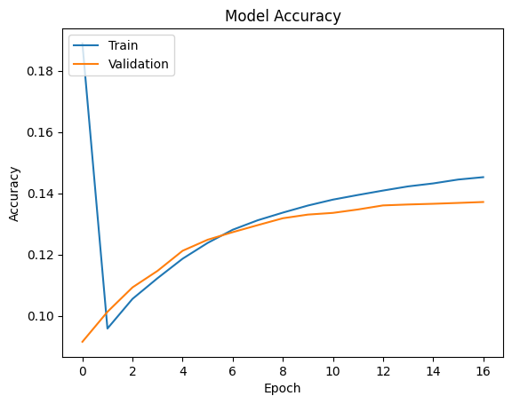
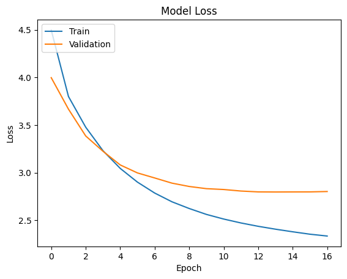
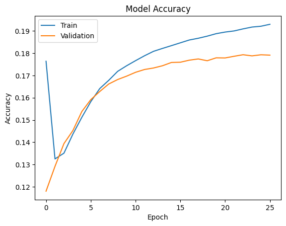
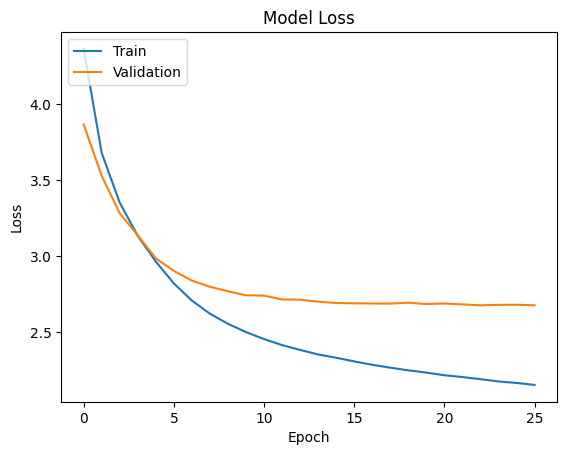

# English ↔ Hindi Neural Machine Translation

This project focuses on building a **Neural Machine Translation (NMT)** system using an **Encoder–Decoder LSTM model** that translates text **from English to Hindi and vice versa**. The model is trained on a cleaned parallel corpus and supports inference via both a **Streamlit app** and **Python functions**.

<br>


---

## 📌 Problem Statement

Develop a deep learning-based system that can automatically translate sentences between English and Hindi using a custom-trained neural model.

---

## 🔧 Tech Stack Used

* 🐍 **Python**
* 🔶 **TensorFlow / Keras**
* 📊 **NumPy**, **Pandas**
* 📈 **Matplotlib**, **Seaborn**
* 🧠 **LSTM-based Seq2Seq Model**
* 🌐 **Streamlit** (for Web UI)

---

## 📁 Folder Structure

```
translation-project/
│
├── app.py                         # Streamlit app
├── helper_methods.py              # Translation functions
├── requirements.txt
├── README.md
│
├───data/
│   ├── train.txt, test.txt, dev.txt
│   ├── merged_df.csv, output_train.csv, etc.
│   └── hindi-visual-genome-*.gz
│
├───models/
│   ├── english_to_hindi_model.keras
│   ├── hindi_to_english_model.keras
│   └── tokenizers_for_*.pkl
│
└───notebooks/
    ├── Data Preprocessing.ipynb
    ├── english_to_hindi.ipynb
    └── hindi_to_english.ipynb
```

---

## 🚀 Project Workflow

### 1. **Data Preprocessing**

* Lowercasing
* Adding `<sos>` and `<eos>` tokens
* Tokenization and padding
* Saving tokenizers with `pickle`

### 2. **Model Training**

* Encoder-Decoder architecture using LSTM
* Trained with teacher forcing
* Separate models for English→Hindi and Hindi→English

### 3. **Model Inference**

* Greedy decoding step-by-step
* `<sos>` used as start token
* `<eos>` used to stop generation

---

## 📊 Dataset Used

* 📚 **Hindi Visual Genome** parallel corpus
* **Dataset Download link** [click here to download](https://lindat.mff.cuni.cz/repository/items/2c94729a-82f4-460f-a6e7-c14988ddf58a)
* Cleaned parallel sentence files: `train.txt`, `test.txt`, `dev.txt`
* Total sentence pairs: \~31,520
* Used for both training and evaluation

---

## 🧪 Notebooks

| Notebook                   | Description                                 |
| -------------------------- | ------------------------------------------- |
| `Data Preprocessing.ipynb` | Text cleaning, tokenization, and formatting |
| `english_to_hindi.ipynb`   | Model training for English → Hindi          |
| `hindi_to_english.ipynb`   | Model training for Hindi → English          |

## English to Hindi Model
* model has **7,644,404** trainable parameters
* used earlystopping 
* trained for 17 epoch
* **accuracy**: 0.1469 and **loss**: 2.2828 
* **val_accuracy**: 0.1371 and  **val_loss**: 2.8033




---

## Hindi to English Model
* model has **7,553,683** trainable parameters
* used earlystopping 
* trained for 26 epoch
* **accuracy**: 0.1943 and **loss**: 2.0994 
* **val_accuracy**: 0.1791 and **val_loss**: 2.6759




---

## 🚀 How to Run

1. **Clone the repository**
    ````
    git clone https://github.com/manishKrMahto/TCS-Stock-Price-Prediction.git
    cd TCS-Stock-Price-Prediction
    ````
2. **Install dependencies**
    ````
   pip install -r requirements.txt
    ````
3. **Run notebook**
   Open **english_to_hindi.ipynb** or **hindi_to_english.ipynb** in Jupyter/Colab

4. **Streamlit App**
    ```bash
    streamlit run app.py
    ```
---


### 🐍 Use as Python Module

```python
from helper_methods import predict_english_to_hindi, predict_hindi_to_english

print(predict_english_to_hindi("the wall is brown"))
# Output: दीवार भूरा है

print(predict_hindi_to_english("कुत्ता घास में बैठा है"))
# Output: dog sitting in grass
```

---

## 📈 Results

| Direction | Sample Input           | Output                          |
| --------- | ---------------------- | ------------------------------- |
| EN → HI   | `the wall is brown`        | `दीवार भूरा है`                |
| HI → EN   | `कुत्ता घास में बैठा है` | `dog sitting in grass` |

---

## 🧠 Future Improvements

* Add Beam Search for better translation quality
* Evaluate using BLEU Scores
* Convert to Transformer-based model
* Host using Streamlit Cloud / Hugging Face Spaces

---

## 🙋‍♂️ Author

**Manish Kumar Mahto**
📧 [manishcode123@gmail.com](mailto:manishcode123@gmail.com)
🌐 [Portfolio](https://manishkrmahto.github.io/Manish-Kumar-Mahto/)
💼 [LinkedIn](https://www.linkedin.com/in/manish-kumar-mahto/)
🐙 [GitHub](https://github.com/manishKrMahto)

---

## 📜 License

This project is licensed under the **MIT License**.